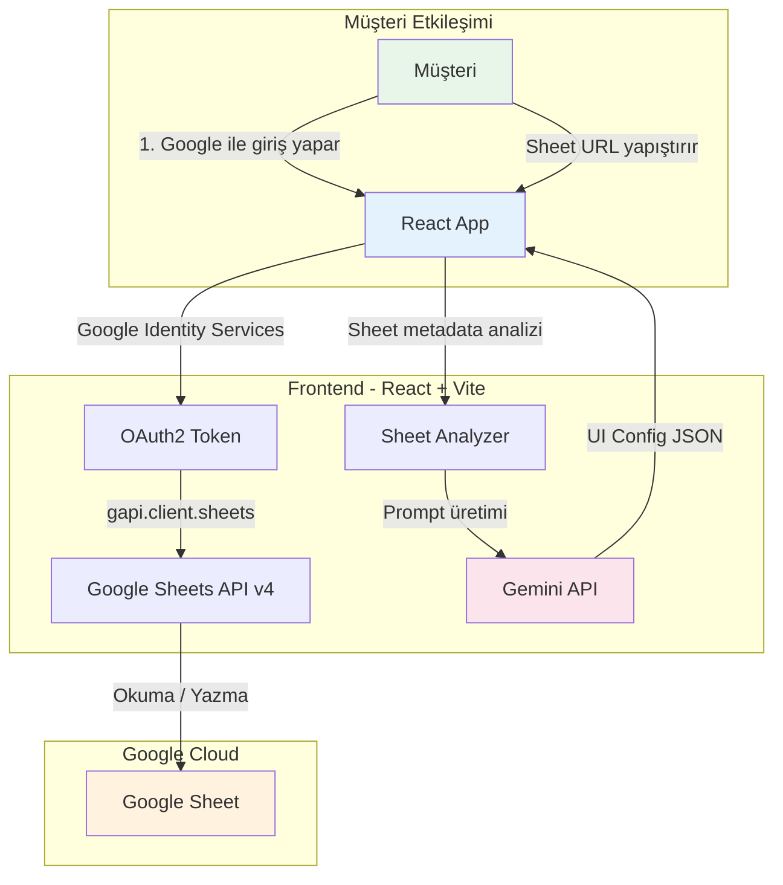
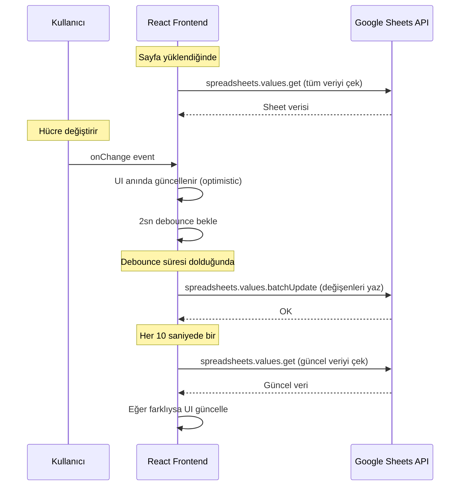
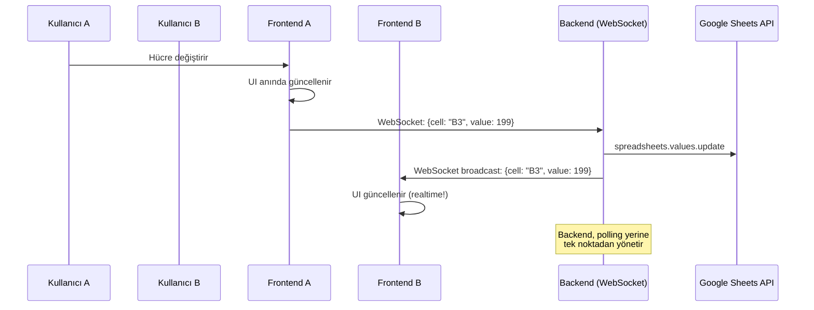

# CanvasSheet — Mimari Plan (v1)

> **Tarih:** 2026-05-01
> **Odak Modül:** Budget Simulation
> **Yaklaşım:** Frontend-only (backend entegrasyonu sonra)

---

## 1. Kararlar Özeti

| Karar | Seçim | Gerekçe |
|---|---|---|
| Backend | Yok (şimdilik) | Mevcut backend'e sonra entegre edilecek |
| Veri erişimi | Google Sheets API v4 (frontend OAuth) | Apps Script'e gerek yok, CORS sorunu yok |
| Realtime sync | Debounced Write + Polling | WebSocket, backend gelince eklenecek |
| Rate limiting | Kodsal (batch + backoff) | Ücretli plan yok |
| AI Engine | Gemini 3.1 Flash Lite | 20 RPD / 500 RPD kotası |
| Öncelik | Budget modülü | Diğer modüller sonra |
| MCP | Kullanılmayacak | Sheets API yeterli |

---

## 2. Mimari Genel Bakış



---

## 3. CORS Sorunu Var mı?

**Hayır.** Frontend-only yaklaşımda Google Sheets API doğrudan tarayıcıdan çağrılabilir.

### Neden CORS sorunu yaşanmaz:

| Yaklaşım | CORS Durumu | Açıklama |
|---|---|---|
| CSV Export + Apps Script (eski) | ❌ Sorunlu | Google 302 redirect yapar, tarayıcı engellenip 401/403 hatası |
| Google Sheets API v4 (yeni) | ✅ Sorunsuz | Google API endpoint'leri tarayıcı isteklerini (CORS) destekler |

### Nasıl Çalışır:

```
1. Kullanıcı "Google ile Giriş Yap" butonuna tıklar
2. Google Identity Services (GIS) popup açılır
3. Kullanıcı kendi Google hesabıyla oturum açar
4. Frontend bir OAuth2 access_token alır
5. Bu token ile gapi.client.sheets üzerinden doğrudan okuma/yazma yapılır
6. Kullanıcı zaten kendi Sheet'inin sahibi olduğu için ek izin gerekmez!
```

> [!IMPORTANT]
> **Kritik avantaj:** Kullanıcı kendi Google hesabıyla giriş yaptığı için, kendi Sheet'lerine
> zaten erişim hakkı vardır. Kimseyle paylaşmasına gerek yoktur!
> Service Account'a ihtiyaç olmaz. "Şu email'e izin verin" adımı tamamen ortadan kalkar.

### Gerekli Google Cloud Kurulumu (Tek Seferlik, Geliştirici Tarafında):

```
1. Google Cloud Console → Yeni Proje oluştur
2. "Google Sheets API" ve "Google Drive API" aktif et
3. OAuth 2.0 Client ID oluştur (Web Application tipi)
4. Authorized JavaScript origins: http://localhost:5173 (dev), https://yourdomain.com (prod)
5. Authorized redirect URIs: aynı domainler
6. Client ID'yi frontend koduna ekle (bu public bilgidir, güvenlik riski yoktur)
```

---

## 4. Müşteri Deneyimi Akışı

```
┌─────────────────────────────────────────────────────────────────┐
│  ADIM 1: Giriş                                                 │
│  ┌─────────────────────────────────────────────────────────┐    │
│  │  🔐 Google ile Giriş Yap                                │    │
│  │  [Sign in with Google]  ← Tek tıklama                  │    │
│  └─────────────────────────────────────────────────────────┘    │
│                                                                 │
│  ADIM 2: Sheet Bağlama                                         │
│  ┌─────────────────────────────────────────────────────────┐    │
│  │  📋 Google Sheet URL'nizi yapıştırın:                   │    │
│  │  [https://docs.google.com/spreadsheets/d/1Atu...]      │    │
│  │                                                         │    │
│  │  [🔗 Sheet'i Analiz Et]                                 │    │
│  └─────────────────────────────────────────────────────────┘    │
│                                                                 │
│  ADIM 3: Otomatik Dashboard (AI ile)                           │
│  ┌─────────────────────────────────────────────────────────┐    │
│  │  ✅ Sheet analiz edildi!                                 │    │
│  │  Tespit edilen yapı: Bütçe Tablosu                      │    │
│  │  • 4 gelir kalemi, 4 gider kalemi                       │    │
│  │  • 12 aylık veri                                        │    │
│  │                                                         │    │
│  │  [📊 Dashboard Oluştur]                                 │    │
│  └─────────────────────────────────────────────────────────┘    │
│                                                                 │
│  ADIM 4: Canlı Dashboard                                       │
│  ┌─────────────────────────────────────────────────────────┐    │
│  │  Mevcut Budget Simulation Workspace ayağa kalkar        │    │
│  │  Hücre düzenlemeleri → Debounce → Sheets API yazma      │    │
│  │  Periyodik polling → Sheet'ten güncel veri çekme        │    │
│  └─────────────────────────────────────────────────────────┘    │
└─────────────────────────────────────────────────────────────────┘
```

**Müşterinin yapması gereken:** Sadece Google ile giriş + Sheet URL yapıştır. **Hepsi bu.**

---

## 5. Realtime Duplex Sync Stratejisi

### Faz 1: Şimdi (Backend Yok)



**Neden polling?** Google Sheets API'de gerçek zamanlı "push notification" (webhook) mekanizması
hücre bazında çalışmaz. Drive API'nin `changes.watch` metodu sadece "dosya değişti" bilgisi verir,
hangi hücre değiştiğini söylemez. Bu yüzden polling en pratik çözümdür.

### Faz 2: Backend Gelince (WebSocket)



---

## 6. Rate Limiting Stratejisi

### Google Sheets API Kotaları

| Kota | Limit | Açıklama |
|---|---|---|
| Okuma (proje) | 300 req/dk | Tüm kullanıcılar toplamı |
| Yazma (proje) | 300 req/dk | Tüm kullanıcılar toplamı |
| Okuma (kullanıcı) | 60 req/dk | Tek kullanıcı |
| Yazma (kullanıcı) | 60 req/dk | Tek kullanıcı |

### Ücretli Plan Var mı?

**Hayır.** Google Sheets API tamamen ücretsizdir ve ücretli bir "premium tier" yoktur.
Kota artışı için Google Cloud Console üzerinden talep gönderilebilir ancak onay garantisi yoktur.

### Kodsal Çözüm (Zorunlu)

```javascript
// 1. Batch Requests — Birden fazla hücreyi tek istekte güncelle
// Kötü: Her hücre için ayrı istek (12 ay × 8 satır = 96 istek!)
// İyi: Tek batchUpdate isteği ile tümünü gönder (1 istek)

spreadsheets.values.batchUpdate({
  spreadsheetId: SHEET_ID,
  valueInputOption: 'USER_ENTERED',
  data: [
    { range: 'Sheet1!B2:M2', values: [[199, 30, 22, ...]] },
    { range: 'Sheet1!B3:M3', values: [[8, 8.2, 8.4, ...]] },
    // ... tüm değişen satırlar
  ]
});
// Bu tek istek, 96 ayrı isteğin işini yapar!

// 2. Debounce — Kullanıcı yazmayı bitirene kadar bekle
const DEBOUNCE_MS = 2000; // 2 saniye

// 3. Exponential Backoff — 429 hatası gelirse yavaşla
async function fetchWithBackoff(fn, maxRetries = 3) {
  for (let i = 0; i < maxRetries; i++) {
    try {
      return await fn();
    } catch (err) {
      if (err.status === 429) {
        const waitMs = Math.pow(2, i) * 1000; // 1s, 2s, 4s
        await new Promise(r => setTimeout(r, waitMs));
      } else throw err;
    }
  }
}

// 4. Polling Aralığı — Çok sık sorgulamayı engelle
const POLL_INTERVAL_MS = 10000; // 10 saniye
// 60 req/dk kullanıcı kotası → 10sn aralık = 6 req/dk (güvenli)
```

### Kota Bütçesi (Budget Modülü İçin)

```
Tek kullanıcı senaryosu:
- Sayfa yüklenme: 1 GET isteği
- Polling: 6 GET/dk (10sn aralık)
- Yazma: Ortalama 3-5 batchUpdate/dk (aktif düzenleme sırasında)
- Toplam: ~11 req/dk (kota: 60 req/dk → %18 kullanım, güvenli ✅)

10 eşzamanlı kullanıcı:
- Toplam: ~110 req/dk (proje kotası: 300 → %37 kullanım, güvenli ✅)

50 eşzamanlı kullanıcı:
- Toplam: ~550 req/dk (proje kotası: 300 → ❌ AŞILIR)
- Çözüm: Polling aralığını 30sn'ye çıkar veya kota artışı talep et
```

---

## 7. AI Prompt Engine — Gemini Entegrasyonu

### Model Seçimi

| Model | RPD | Kullanım |
|---|---|---|
| Gemini 2.5 Flash | 9-20 RPD | Başlangıç deneme |
| **Gemini 3.1 Flash Lite** | **20-500 RPD** | **Üretim önerisi** |

### Sheet Analiz → UI Config Akışı

```
┌──────────────────────────────────────────────────────┐
│  ADIM 1: Sheet Metadata Çıkarma (Frontend)           │
├──────────────────────────────────────────────────────┤
│                                                      │
│  Google Sheets API ile:                              │
│  • Başlıklar (headers) okunur                        │
│  • İlk 5 satır veri okunur (tip tespiti için)       │
│  • Sheet/Tab isimleri alınır                         │
│                                                      │
│  Çıktı:                                             │
│  {                                                   │
│    "sheetName": "Budget 2026",                       │
│    "headers": ["Category", "Jan", "Feb", ...],       │
│    "sampleData": [["License - NA", 10, 30, ...]],   │
│    "rowCount": 12,                                   │
│    "dataTypes": ["string", "number", "number", ...]  │
│  }                                                   │
│                                                      │
├──────────────────────────────────────────────────────┤
│  ADIM 2: Prompt Oluşturma                            │
├──────────────────────────────────────────────────────┤
│                                                      │
│  System Prompt:                                      │
│  "Sen bir dashboard UI tasarımcısısın.               │
│   Verilen sheet yapısına göre bir UI config JSON     │
│   üret. Kullanılabilecek widget'lar: kpi_card,      │
│   bar_chart, line_chart, editable_table,            │
│   pie_chart, kanban_board, gantt_chart"             │
│                                                      │
│  User Prompt:                                        │
│  "Sheet metadata: {metadata_json}                    │
│   Kullanıcının talebi: Bütçe simülasyon dashboard'u │
│   oluştur."                                          │
│                                                      │
├──────────────────────────────────────────────────────┤
│  ADIM 3: Gemini Yanıtı → UI Config                   │
├──────────────────────────────────────────────────────┤
│                                                      │
│  {                                                   │
│    "layout": "grid",                                 │
│    "widgets": [                                      │
│      {                                               │
│        "type": "kpi_card",                           │
│        "title": "ANNUAL REVENUE",                    │
│        "dataSource": {                               │
│          "rows": "revenue",                          │
│          "aggregation": "sum",                       │
│          "columns": ["Jan"..."Dec"]                  │
│        }                                             │
│      },                                              │
│      {                                               │
│        "type": "bar_chart",                          │
│        "title": "Profitability Performance",         │
│        "dataSource": { ... }                         │
│      },                                              │
│      {                                               │
│        "type": "editable_table",                     │
│        "title": "Simulation Table",                  │
│        "dataSource": { ... }                         │
│      }                                               │
│    ]                                                 │
│  }                                                   │
│                                                      │
├──────────────────────────────────────────────────────┤
│  ADIM 4: React Dinamik Render                        │
├──────────────────────────────────────────────────────┤
│                                                      │
│  UI Config JSON → Widget Registry → React Render     │
│  Her widget tipi için önceden hazır component var     │
│  Config sadece "hangi widget, hangi veri" belirler    │
│                                                      │
└──────────────────────────────────────────────────────┘
```

---

## 8. Dosya Yapısı (Hedef)

```
src/
├── main.jsx
├── App.jsx                          # Ana routing
├── index.css                        # Global stiller
│
├── auth/
│   ├── GoogleAuthProvider.jsx       # GIS OAuth2 context
│   └── useGoogleAuth.js            # Hook: login/logout/token
│
├── services/
│   ├── sheetsService.js             # Google Sheets API v4 wrapper
│   │   ├── readSheet()              # spreadsheets.values.get
│   │   ├── writeSheet()             # spreadsheets.values.batchUpdate
│   │   └── getSheetMetadata()       # spreadsheets.get (başlıklar, tab'lar)
│   │
│   ├── rateLimiter.js               # Debounce + backoff + batch
│   ├── sheetAnalyzer.js             # Metadata → yapı analizi
│   └── geminiService.js             # Gemini API çağrıları
│
├── engine/
│   ├── WidgetRegistry.js            # Widget tip → Component eşlemesi
│   ├── DynamicDashboard.jsx         # UI Config JSON → React render
│   └── widgets/
│       ├── KpiCard.jsx
│       ├── BarChart.jsx
│       ├── LineChart.jsx
│       ├── EditableTable.jsx
│       ├── PieChart.jsx
│       ├── KanbanBoard.jsx          # Faz 2
│       └── GanttChart.jsx           # Faz 2
│
├── pages/
│   ├── ConnectPage.jsx              # Google giriş + Sheet URL formu
│   ├── AnalyzePage.jsx              # Sheet analiz sonucu + dashboard oluştur
│   └── DashboardPage.jsx            # Canlı dashboard (dinamik)
│
└── hooks/
    ├── useSheetData.js              # Polling + debounced write hook
    └── useRealtimeSync.js           # Faz 2: WebSocket hook
```

---

## 9. Uygulama Fazları

### Faz 1: MVP — Budget Modülü (Şimdi)

- [x] Mevcut budget dashboard çalışıyor (Apps Script ile)
- [ ] Google Cloud Console'da proje + OAuth Client ID oluştur
- [ ] `GoogleAuthProvider` + `useGoogleAuth` hook'u yaz
- [ ] `sheetsService.js` — Sheets API v4 wrapper (okuma + yazma)
- [ ] `rateLimiter.js` — Debounce + batch + backoff
- [ ] `ConnectPage.jsx` — Google giriş + Sheet URL form
- [ ] Mevcut `BudgetPage.jsx`'i Sheets API v4 ile refactor et
- [ ] Apps Script bağımlılığını tamamen kaldır
- [ ] Polling ile duplex sync (10sn aralık)

### Faz 2: AI Destekli Dinamik Dashboard

- [ ] `sheetAnalyzer.js` — Sheet yapısını otomatik tespit
- [ ] `geminiService.js` — Gemini 3.1 Flash Lite entegrasyonu
- [ ] `WidgetRegistry.js` + `DynamicDashboard.jsx`
- [ ] `AnalyzePage.jsx` — AI ile otomatik dashboard oluşturma
- [ ] Widget component library (KPI, Chart, Table)

### Faz 3: Çoklu Modül + Backend Entegrasyonu

- [ ] Kanban, Gantt, Vortex widget'ları
- [ ] Backend proxy entegrasyonu (mevcut backend'e bağlanma)
- [ ] WebSocket ile gerçek zamanlı multi-user sync
- [ ] Kullanıcı dashboard'larını kaydetme/yükleme

---

## 10. Önemli Notlar

> [!WARNING]
> **OAuth Token Süresi:** Google OAuth access token'ları ~1 saat geçerlidir.
> Frontend'de token refresh mekanizması yazılmalıdır.
> `google.accounts.oauth2.initTokenClient` bunu otomatik yönetir.

> [!WARNING]
> **API Key vs OAuth:** Google Sheets API'yi public (sadece okuma) sheet'ler için
> API Key ile de çağırabilirsiniz. Ancak yazma işlemi için mutlaka OAuth gerekir.
> Biz hem okuma hem yazma yapacağımız için OAuth kullanıyoruz.

> [!TIP]
> **Batch Update Optimizasyonu:** Kullanıcı 5 hücreyi arka arkaya değiştirdiğinde,
> her biri için ayrı istek atmak yerine 2sn debounce ile bekleyip tüm değişiklikleri
> tek bir `batchUpdate` isteğinde göndermek hem kota hem performans açısından kritik.

> [!NOTE]
> **Frontend'de Credential Güvenliği:** OAuth Client ID public bir bilgidir ve
> frontend kodunda olması güvenlik riski oluşturmaz (Google, domain kısıtlaması yapar).
> Ancak Service Account JSON key'i asla frontend'e konulmamalıdır — bu yüzden
> Service Account yerine kullanıcının kendi OAuth girişini kullanıyoruz.
